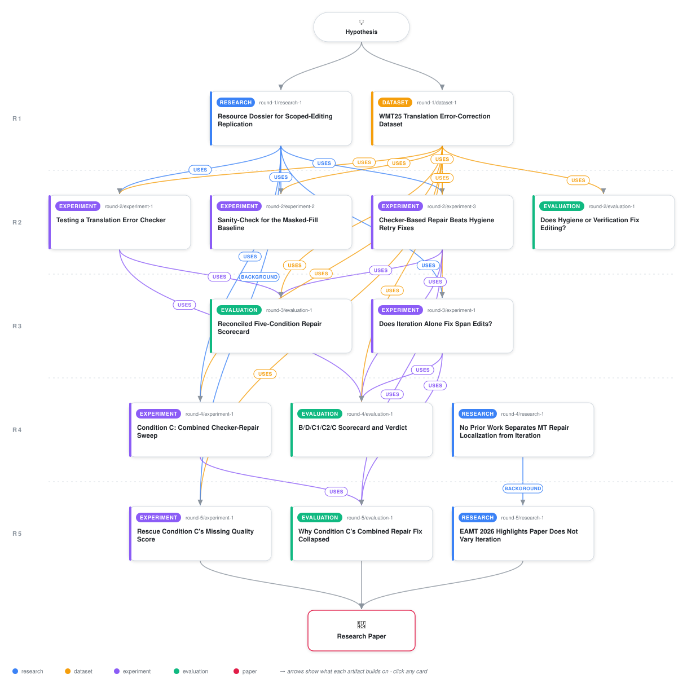

# When Repair Levers Combine, Machine Translation Editing Gets Worse

<div align="center">

<a href="https://cdn.jsdelivr.net/gh/ai-inventor-papers/ai-invention-e9bf19-isolating-what-fixes-failed-span-editing@main/workflow.svg">
<picture>
  <source media="(prefers-color-scheme: dark)" srcset="workflow-dark.svg">
  
</picture>
</a>

<sub>🖱️ <b><a href="https://cdn.jsdelivr.net/gh/ai-inventor-papers/ai-invention-e9bf19-isolating-what-fixes-failed-span-editing@main/workflow.svg">Open the interactive diagram</a></b> — every card links to its artifact folder.</sub>

</div>

> **TL;DR** — This iteration resolves the paper's one remaining open axis: a scoring-only rerun obtains Condition C's real DeltaCOMET on the same wmt22-cometkiwi-da checkpoint used by every other condition (-0.0173, statistically indistinguishable from the unedited baseline and roughly 5x worse than broadened localization alone), showing that combining broadened localization with iterative verification fails to combine their gains on the quality axis, not just the correctness axes measured previously. A reviewer-requested precision-stratified re-analysis shows the certificate-rate collapse behind Condition C's elevated regression rate concentrates in the checker's lowest-precision categories (0.089 certificate rate at precision 0.575-0.65) versus its highest-precision one (0.35 at precision 0.78-0.86), consistent with, though not proof of, checker-noise-driven churn. A restricted-population secondary analysis confirms the headline ordering survives on only the checker's fully-eligible cells, and the project's literature search is closed with a seventh checked candidate (EAMT 2026) that varies only localization breadth with no iteration axis.

<details>
<summary>Full hypothesis</summary>

Padmanabhan (2025)'s WMT25 Task 3 secondary system (SURREYPAI-S2) -- QE-flagged spans masked and filled in one uncorrected pass, no re-check -- scored the worst of eight ranked Task 3 entries. Five iterations of controlled testing on a fixed repair model (google/gemma-3-12b-it), a deterministic content-invariant checker, and the same real wmt22-cometkiwi-da checkpoint for every condition now DISCONFIRM, on every axis this project has measured, the hypothesis that broadened localization (C1) and iteration (C2) are complementary, freely-combinable levers. This iteration closes the paper's one remaining open axis and adds a reviewer-driven mechanism analysis, without materially changing the headline: (1) Condition C's real DeltaCOMET, obtained this iteration on the same checkpoint used everywhere else after two prior HuggingFace Hub checkpoint-access failures (resolved this time via a mirror endpoint plus wall-clock-separated retry windows, first attempt succeeding on the primary endpoint with no 429), is -0.01725 (95% CI [-0.02514,-0.01030], n=320), statistically indistinguishable from the unedited baseline's -0.0164 and from iteration-alone C2's -0.0166, and roughly 5x worse than broadened-localization-alone C1's -0.0035. The quality axis now matches what was already measured on correctness: combining the levers recovers neither's gain. (2) A reviewer-requested precision-stratified re-analysis of Condition C's certificate-rate collapse (0.917 at C2 down to 0.267 once localization broadens) finds it concentrates in the checker's lowest-precision categories: mean certificate rate 0.089 in the low-precision tier (number_unit_date, quantifier_scope; checker precision 0.575-0.65) versus 0.35 in the high-precision tier (negation_polarity; precision 0.78-0.86). This is consistent with, but does not prove, checker-noise-driven churn as a partial explanation for the collapse rather than uniform genuine cross-invariant regression -- the split is only 2 cells versus 3 and is explicitly reported as low-power, not causal. (3) A restricted-population re-analysis, computed from the checker's own recall>=0.5 AND precision>=0.5 eligibility rule (5 of 8 (language,category) cells, wider than this project's own prior restatement, which had omitted negation_polarity), confirms the full headline ordering -- C1 worse regression than C2; Condition C the worst true-regression-rate of all five conditions; certificate-rate collapse from C2 to C -- survives unchanged in direction on only the checker-eligible cells. (4) A worked-example audit of certificate scoring confirms a row's certificate status is computed only over non-excluded invariant categories regardless of the row's own corruption category, and surfaces (without changing any headline result) that Condition C's own re-fit checker validation shows named_entity recall/precision at exactly 0.0/0.0 in its execution environment versus 1.0/0.32 originally -- an unresolved, likely environment-dependent (Stanza NER availability) drift that the paper has checked does not flip the eligible-cell set but has NOT yet checked against the other three checker categories. (5) A pre-registered follow-up widening the pass budget from 3 to 6 (to test whether the certificate-rate collapse is a budget ceiling or a checker-noise ceiling) was launched this iteration but did not reach completion within the run window (checkpointed partway through the 560-row sweep, no aggregate results yet) -- this remains the single most decision-relevant unresolved experiment and is carried forward as the top-priority next artifact, not silently dropped. (6) The literature search is now closed: a seventh and final candidate (van Tellingen et al., EAMT 2026, arXiv:2605.21135) was fetched and verified by direct quotation to vary localization breadth (highlight-only vs. highlight-plus-suggested-correction) with zero genuine iteration language anywhere in its text (a full-text regex sweep for iteration/re-check/re-verify terms returns only 'repeated measures ANOVA', a statistics term) -- confirming, as with every other checked candidate, that no prior published work has run this project's specific broadened-localization x iteration factorial design. We now hold, with the quality axis fully closed on real numbers for the first time, that broadened one-pass localization and narrow-but-iterated repair are two genuinely different, non-dominating, non-additive mechanisms whose naive combination under a shared pass budget produces the worst outcome on every axis measured -- but this reviewer round has surfaced two things this hypothesis must now state as open rather than settled: the paper's 'statistically indistinguishable' language throughout rests on confidence-interval overlap, not a formal equivalence test (TOST), which is a materially weaker standard than the confident phrasing implies at these interval widths (half-widths ~0.007-0.008 on n=320); and the entire empirical result, however internally rigorous, is scoped to two Slavic language pairs (en-ru_RU, en-uk_UA) sharing a capitalization-cued named-entity advantage the checker does not have on non-Slavic scripts, a substitute repair model with only a borderline-passing (1.52x against a [0.5x,2.0x] band) fidelity check against the original TowerPlus-9B, and a fixed 3-pass budget -- so the general-sounding claim ('combining localization breadth with iteration does not combine their gains') is not yet shown to generalize past this specific configuration, and should not be stated without that qualifier going forward.

</details>

[](https://cdn.jsdelivr.net/gh/ai-inventor-papers/ai-invention-e9bf19-isolating-what-fixes-failed-span-editing@main/paper.pdf) [](https://github.com/ai-inventor-papers/ai-invention-e9bf19-isolating-what-fixes-failed-span-editing/tree/main/paper_latex)

This repository contains all **14 artifacts** produced across **5 rounds** of an autonomous AI research run — round by round, exactly in the order they were invented.

## Round 1

| Artifact | Type | Demo | Source | Builds on |
|----------|------|------|--------|-----------|
| **[Resource Dossier for Scoped-Editing Replication](https://github.com/ai-inventor-papers/ai-invention-e9bf19-isolating-what-fixes-failed-span-editing/tree/main/round-1/research-1)** | [](https://github.com/ai-inventor-papers/ai-invention-e9bf19-isolating-what-fixes-failed-span-editing/tree/main/round-1/research-1) | [](https://github.com/ai-inventor-papers/ai-invention-e9bf19-isolating-what-fixes-failed-span-editing/blob/main/round-1/research-1/demo/research_demo.md) | [](https://github.com/ai-inventor-papers/ai-invention-e9bf19-isolating-what-fixes-failed-span-editing/tree/main/round-1/research-1/src) | — |
| **[WMT25 Translation Error-Correction Dataset](https://github.com/ai-inventor-papers/ai-invention-e9bf19-isolating-what-fixes-failed-span-editing/tree/main/round-1/dataset-1)** | [](https://github.com/ai-inventor-papers/ai-invention-e9bf19-isolating-what-fixes-failed-span-editing/tree/main/round-1/dataset-1) | [](https://colab.research.google.com/github/ai-inventor-papers/ai-invention-e9bf19-isolating-what-fixes-failed-span-editing/blob/main/round-1/dataset-1/demo/data_code_demo.ipynb) | [](https://github.com/ai-inventor-papers/ai-invention-e9bf19-isolating-what-fixes-failed-span-editing/tree/main/round-1/dataset-1/src) | — |

## Round 2

| Artifact | Type | Demo | Source | Builds on |
|----------|------|------|--------|-----------|
| **[Testing a Translation Error Checker](https://github.com/ai-inventor-papers/ai-invention-e9bf19-isolating-what-fixes-failed-span-editing/tree/main/round-2/experiment-1)** | [](https://github.com/ai-inventor-papers/ai-invention-e9bf19-isolating-what-fixes-failed-span-editing/tree/main/round-2/experiment-1) | [](https://colab.research.google.com/github/ai-inventor-papers/ai-invention-e9bf19-isolating-what-fixes-failed-span-editing/blob/main/round-2/experiment-1/demo/method_code_demo.ipynb) | [](https://github.com/ai-inventor-papers/ai-invention-e9bf19-isolating-what-fixes-failed-span-editing/tree/main/round-2/experiment-1/src) | <sub><i>uses:</i><br/>[research‑1&nbsp;(R1)](https://github.com/ai-inventor-papers/ai-invention-e9bf19-isolating-what-fixes-failed-span-editing/tree/main/round-1/research-1)<br/>[dataset‑1&nbsp;(R1)](https://github.com/ai-inventor-papers/ai-invention-e9bf19-isolating-what-fixes-failed-span-editing/tree/main/round-1/dataset-1)</sub> |
| **[Sanity-Check for the Masked-Fill Baseline](https://github.com/ai-inventor-papers/ai-invention-e9bf19-isolating-what-fixes-failed-span-editing/tree/main/round-2/experiment-2)** | [](https://github.com/ai-inventor-papers/ai-invention-e9bf19-isolating-what-fixes-failed-span-editing/tree/main/round-2/experiment-2) | [](https://colab.research.google.com/github/ai-inventor-papers/ai-invention-e9bf19-isolating-what-fixes-failed-span-editing/blob/main/round-2/experiment-2/demo/method_code_demo.ipynb) | [](https://github.com/ai-inventor-papers/ai-invention-e9bf19-isolating-what-fixes-failed-span-editing/tree/main/round-2/experiment-2/src) | <sub><i>uses:</i><br/>[research‑1&nbsp;(R1)](https://github.com/ai-inventor-papers/ai-invention-e9bf19-isolating-what-fixes-failed-span-editing/tree/main/round-1/research-1)<br/>[dataset‑1&nbsp;(R1)](https://github.com/ai-inventor-papers/ai-invention-e9bf19-isolating-what-fixes-failed-span-editing/tree/main/round-1/dataset-1)</sub> |
| **[Checker-Based Repair Beats Hygiene Retry Fixes](https://github.com/ai-inventor-papers/ai-invention-e9bf19-isolating-what-fixes-failed-span-editing/tree/main/round-2/experiment-3)** | [](https://github.com/ai-inventor-papers/ai-invention-e9bf19-isolating-what-fixes-failed-span-editing/tree/main/round-2/experiment-3) | [](https://colab.research.google.com/github/ai-inventor-papers/ai-invention-e9bf19-isolating-what-fixes-failed-span-editing/blob/main/round-2/experiment-3/demo/method_code_demo.ipynb) | [](https://github.com/ai-inventor-papers/ai-invention-e9bf19-isolating-what-fixes-failed-span-editing/tree/main/round-2/experiment-3/src) | <sub><i>uses:</i><br/>[research‑1&nbsp;(R1)](https://github.com/ai-inventor-papers/ai-invention-e9bf19-isolating-what-fixes-failed-span-editing/tree/main/round-1/research-1)<br/>[dataset‑1&nbsp;(R1)](https://github.com/ai-inventor-papers/ai-invention-e9bf19-isolating-what-fixes-failed-span-editing/tree/main/round-1/dataset-1)</sub> |
| **[Does Hygiene or Verification Fix Editing?](https://github.com/ai-inventor-papers/ai-invention-e9bf19-isolating-what-fixes-failed-span-editing/tree/main/round-2/evaluation-1)** | [](https://github.com/ai-inventor-papers/ai-invention-e9bf19-isolating-what-fixes-failed-span-editing/tree/main/round-2/evaluation-1) | [](https://colab.research.google.com/github/ai-inventor-papers/ai-invention-e9bf19-isolating-what-fixes-failed-span-editing/blob/main/round-2/evaluation-1/demo/eval_code_demo.ipynb) | [](https://github.com/ai-inventor-papers/ai-invention-e9bf19-isolating-what-fixes-failed-span-editing/tree/main/round-2/evaluation-1/src) | <sub><i>uses:</i><br/>[dataset‑1&nbsp;(R1)](https://github.com/ai-inventor-papers/ai-invention-e9bf19-isolating-what-fixes-failed-span-editing/tree/main/round-1/dataset-1)</sub> |

## Round 3

| Artifact | Type | Demo | Source | Builds on |
|----------|------|------|--------|-----------|
| **[Does Iteration Alone Fix Span Edits?](https://github.com/ai-inventor-papers/ai-invention-e9bf19-isolating-what-fixes-failed-span-editing/tree/main/round-3/experiment-1)** | [](https://github.com/ai-inventor-papers/ai-invention-e9bf19-isolating-what-fixes-failed-span-editing/tree/main/round-3/experiment-1) | [](https://colab.research.google.com/github/ai-inventor-papers/ai-invention-e9bf19-isolating-what-fixes-failed-span-editing/blob/main/round-3/experiment-1/demo/method_code_demo.ipynb) | [](https://github.com/ai-inventor-papers/ai-invention-e9bf19-isolating-what-fixes-failed-span-editing/tree/main/round-3/experiment-1/src) | <sub><i>uses:</i><br/>[dataset‑1&nbsp;(R1)](https://github.com/ai-inventor-papers/ai-invention-e9bf19-isolating-what-fixes-failed-span-editing/tree/main/round-1/dataset-1)<br/>[research‑1&nbsp;(R1)](https://github.com/ai-inventor-papers/ai-invention-e9bf19-isolating-what-fixes-failed-span-editing/tree/main/round-1/research-1)</sub> |
| **[Reconciled Five-Condition Repair Scorecard](https://github.com/ai-inventor-papers/ai-invention-e9bf19-isolating-what-fixes-failed-span-editing/tree/main/round-3/evaluation-1)** | [](https://github.com/ai-inventor-papers/ai-invention-e9bf19-isolating-what-fixes-failed-span-editing/tree/main/round-3/evaluation-1) | [](https://colab.research.google.com/github/ai-inventor-papers/ai-invention-e9bf19-isolating-what-fixes-failed-span-editing/blob/main/round-3/evaluation-1/demo/eval_code_demo.ipynb) | [](https://github.com/ai-inventor-papers/ai-invention-e9bf19-isolating-what-fixes-failed-span-editing/tree/main/round-3/evaluation-1/src) | <sub><i>uses:</i><br/>[dataset‑1&nbsp;(R1)](https://github.com/ai-inventor-papers/ai-invention-e9bf19-isolating-what-fixes-failed-span-editing/tree/main/round-1/dataset-1)<br/>[experiment‑3&nbsp;(R2)](https://github.com/ai-inventor-papers/ai-invention-e9bf19-isolating-what-fixes-failed-span-editing/tree/main/round-2/experiment-3)<br/>[experiment‑1&nbsp;(R2)](https://github.com/ai-inventor-papers/ai-invention-e9bf19-isolating-what-fixes-failed-span-editing/tree/main/round-2/experiment-1)</sub> |

## Round 4

| Artifact | Type | Demo | Source | Builds on |
|----------|------|------|--------|-----------|
| **[Condition C: Combined Checker-Repair Sweep](https://github.com/ai-inventor-papers/ai-invention-e9bf19-isolating-what-fixes-failed-span-editing/tree/main/round-4/experiment-1)** | [](https://github.com/ai-inventor-papers/ai-invention-e9bf19-isolating-what-fixes-failed-span-editing/tree/main/round-4/experiment-1) | [](https://colab.research.google.com/github/ai-inventor-papers/ai-invention-e9bf19-isolating-what-fixes-failed-span-editing/blob/main/round-4/experiment-1/demo/method_code_demo.ipynb) | [](https://github.com/ai-inventor-papers/ai-invention-e9bf19-isolating-what-fixes-failed-span-editing/tree/main/round-4/experiment-1/src) | <sub><i>uses:</i><br/>[dataset‑1&nbsp;(R1)](https://github.com/ai-inventor-papers/ai-invention-e9bf19-isolating-what-fixes-failed-span-editing/tree/main/round-1/dataset-1)<br/>[research‑1&nbsp;(R1)](https://github.com/ai-inventor-papers/ai-invention-e9bf19-isolating-what-fixes-failed-span-editing/tree/main/round-1/research-1)</sub> |
| **[B/D/C1/C2/C Scorecard and Verdict](https://github.com/ai-inventor-papers/ai-invention-e9bf19-isolating-what-fixes-failed-span-editing/tree/main/round-4/evaluation-1)** | [](https://github.com/ai-inventor-papers/ai-invention-e9bf19-isolating-what-fixes-failed-span-editing/tree/main/round-4/evaluation-1) | [](https://colab.research.google.com/github/ai-inventor-papers/ai-invention-e9bf19-isolating-what-fixes-failed-span-editing/blob/main/round-4/evaluation-1/demo/eval_code_demo.ipynb) | [](https://github.com/ai-inventor-papers/ai-invention-e9bf19-isolating-what-fixes-failed-span-editing/tree/main/round-4/evaluation-1/src) | <sub><i>uses:</i><br/>[experiment‑3&nbsp;(R2)](https://github.com/ai-inventor-papers/ai-invention-e9bf19-isolating-what-fixes-failed-span-editing/tree/main/round-2/experiment-3)<br/>[experiment‑1&nbsp;(R3)](https://github.com/ai-inventor-papers/ai-invention-e9bf19-isolating-what-fixes-failed-span-editing/tree/main/round-3/experiment-1)<br/>[experiment‑1&nbsp;(R2)](https://github.com/ai-inventor-papers/ai-invention-e9bf19-isolating-what-fixes-failed-span-editing/tree/main/round-2/experiment-1)<br/>[dataset‑1&nbsp;(R1)](https://github.com/ai-inventor-papers/ai-invention-e9bf19-isolating-what-fixes-failed-span-editing/tree/main/round-1/dataset-1)</sub> |
| **[No Prior Work Separates MT Repair Localization from Iteratio…](https://github.com/ai-inventor-papers/ai-invention-e9bf19-isolating-what-fixes-failed-span-editing/tree/main/round-4/research-1)** | [](https://github.com/ai-inventor-papers/ai-invention-e9bf19-isolating-what-fixes-failed-span-editing/tree/main/round-4/research-1) | [](https://github.com/ai-inventor-papers/ai-invention-e9bf19-isolating-what-fixes-failed-span-editing/blob/main/round-4/research-1/demo/research_demo.md) | [](https://github.com/ai-inventor-papers/ai-invention-e9bf19-isolating-what-fixes-failed-span-editing/tree/main/round-4/research-1/src) | — |

## Round 5

| Artifact | Type | Demo | Source | Builds on |
|----------|------|------|--------|-----------|
| **[Rescue Condition C's Missing Quality Score](https://github.com/ai-inventor-papers/ai-invention-e9bf19-isolating-what-fixes-failed-span-editing/tree/main/round-5/experiment-1)** | [](https://github.com/ai-inventor-papers/ai-invention-e9bf19-isolating-what-fixes-failed-span-editing/tree/main/round-5/experiment-1) | [](https://colab.research.google.com/github/ai-inventor-papers/ai-invention-e9bf19-isolating-what-fixes-failed-span-editing/blob/main/round-5/experiment-1/demo/method_code_demo.ipynb) | [](https://github.com/ai-inventor-papers/ai-invention-e9bf19-isolating-what-fixes-failed-span-editing/tree/main/round-5/experiment-1/src) | <sub><i>uses:</i><br/>[dataset‑1&nbsp;(R1)](https://github.com/ai-inventor-papers/ai-invention-e9bf19-isolating-what-fixes-failed-span-editing/tree/main/round-1/dataset-1)<br/><i>background:</i><br/>[research‑1&nbsp;(R1)](https://github.com/ai-inventor-papers/ai-invention-e9bf19-isolating-what-fixes-failed-span-editing/tree/main/round-1/research-1)</sub> |
| **[Why Condition C's Combined Repair Fix Collapsed](https://github.com/ai-inventor-papers/ai-invention-e9bf19-isolating-what-fixes-failed-span-editing/tree/main/round-5/evaluation-1)** | [](https://github.com/ai-inventor-papers/ai-invention-e9bf19-isolating-what-fixes-failed-span-editing/tree/main/round-5/evaluation-1) | [](https://colab.research.google.com/github/ai-inventor-papers/ai-invention-e9bf19-isolating-what-fixes-failed-span-editing/blob/main/round-5/evaluation-1/demo/eval_code_demo.ipynb) | [](https://github.com/ai-inventor-papers/ai-invention-e9bf19-isolating-what-fixes-failed-span-editing/tree/main/round-5/evaluation-1/src) | <sub><i>uses:</i><br/>[experiment‑1&nbsp;(R4)](https://github.com/ai-inventor-papers/ai-invention-e9bf19-isolating-what-fixes-failed-span-editing/tree/main/round-4/experiment-1)<br/>[experiment‑3&nbsp;(R2)](https://github.com/ai-inventor-papers/ai-invention-e9bf19-isolating-what-fixes-failed-span-editing/tree/main/round-2/experiment-3)<br/>[experiment‑1&nbsp;(R3)](https://github.com/ai-inventor-papers/ai-invention-e9bf19-isolating-what-fixes-failed-span-editing/tree/main/round-3/experiment-1)</sub> |
| **[EAMT 2026 Highlights Paper Does Not Vary Iteration](https://github.com/ai-inventor-papers/ai-invention-e9bf19-isolating-what-fixes-failed-span-editing/tree/main/round-5/research-1)** | [](https://github.com/ai-inventor-papers/ai-invention-e9bf19-isolating-what-fixes-failed-span-editing/tree/main/round-5/research-1) | [](https://github.com/ai-inventor-papers/ai-invention-e9bf19-isolating-what-fixes-failed-span-editing/blob/main/round-5/research-1/demo/research_demo.md) | [](https://github.com/ai-inventor-papers/ai-invention-e9bf19-isolating-what-fixes-failed-span-editing/tree/main/round-5/research-1/src) | <sub><i>background:</i><br/>[research‑1&nbsp;(R4)](https://github.com/ai-inventor-papers/ai-invention-e9bf19-isolating-what-fixes-failed-span-editing/tree/main/round-4/research-1)</sub> |

## Repository Structure

Artifacts are grouped by the round of invention that produced them. Each
artifact has its own folder with source code and a self-contained demo:

```
.
├── round-1/                         # One folder per round of invention
│   ├── experiment-1/
│   │   ├── README.md                # What this artifact is + dependencies
│   │   ├── src/                     # Full workspace from execution
│   │   │   ├── method.py            # Main implementation
│   │   │   ├── method_out.json      # Full output data
│   │   │   └── ...                  # All execution artifacts
│   │   └── demo/                    # Self-contained demo
│   │       └── method_code_demo.ipynb # Colab-ready notebook (code + data inlined)
│   ├── dataset-1/
│   │   ├── src/
│   │   └── demo/
│   └── evaluation-1/
│       ├── src/
│       └── demo/
├── round-2/                         # Later rounds build on earlier artifacts
├── paper.pdf                        # Research paper
├── paper_latex/                     # LaTeX source files
├── chat/                            # Every prompt, response and tool call, per module
├── workflow.svg                     # Artifact dependency diagram (this page's header)
└── README.md
```

## Running Notebooks

### Option 1: Google Colab (Recommended)

Click the "Open in Colab" badges above to run notebooks directly in your browser.
No installation required!

### Option 2: Local Jupyter

```bash
# Clone the repo
git clone https://github.com/ai-inventor-papers/ai-invention-e9bf19-isolating-what-fixes-failed-span-editing
cd ai-invention-e9bf19-isolating-what-fixes-failed-span-editing

# Install dependencies
pip install jupyter

# Run any artifact's demo notebook
jupyter notebook <artifact_folder>/demo/
```

## Source Code

The original source files are in each artifact's `src/` folder.
These files may have external dependencies - use the demo notebooks for a self-contained experience.

---
*Generated by AI Inventor Pipeline - Automated Research Generation*
